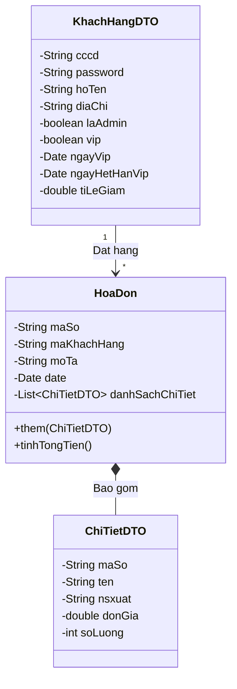
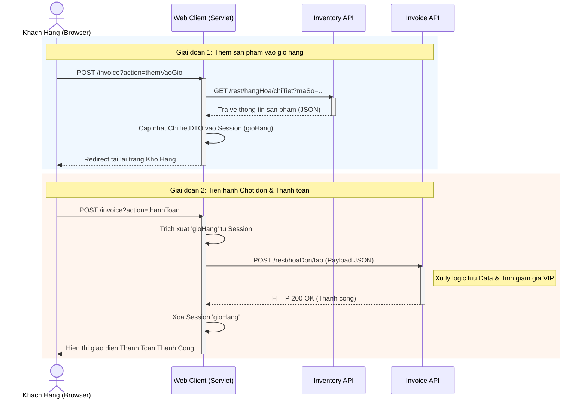

# 🛒 Hệ Thống Quản Lý Kho Hàng \& Mua Sắm Trực Tuyến

Dự án là một hệ thống Website thương mại điện tử / quản lý kho hàng được xây dựng trên nền tảng **Java EE (Enterprise Edition)**. Hệ thống áp dụng kiến trúc phân tán (Distributed Architecture) với các RESTful Web Services xử lý nghiệp vụ độc lập và một Web Client đóng vai trò giao tiếp với người dùng.

\---

## 🏗️ Kiến Trúc Hệ Thống (System Architecture)

Hệ thống được chia làm **5 Project độc lập** để đảm bảo tính module hóa, dễ bảo trì và dễ mở rộng:

### 1\. Project Thư Viện Chung (Common Library)

* **Vai trò:** Chứa các đối tượng truyền tải dữ liệu (DTO - Data Transfer Object), các Models (`KhachHang`, `HangHoa`, `ChiTiet`, `HoaDon`) và các Interfaces (hợp đồng giao tiếp API).
* **Đặc điểm:** Project này được biên dịch thành file `.jar` và import vào tất cả các project bên dưới để đảm bảo tính đồng nhất về mặt dữ liệu toàn hệ thống.

### 2\. Các Project RESTful API (Backend Services)

Hệ thống Backend được chia làm 3 Services riêng biệt chạy độc lập, giao tiếp thông qua chuẩn JSON (sử dụng thư viện JAX-RS / Jersey):

* 📦 **QuanLyTaiKhoan (Customer Service):** Chuyên xử lý logic về người dùng như Đăng nhập, Đăng ký, Cập nhật thông tin, Lấy danh sách người dùng và Đăng ký thẻ VIP.
* 📦 **QuanLyHangHoa (Inventory Service):** Chuyên quản lý kho hàng (Thêm, sửa, xóa sản phẩm) và xuất danh sách sản phẩm cho người dùng mua sắm.
* 📦 **QuanLyHoaDon (Invoice/Cart Service):** Quản lý logic giỏ hàng, chốt đơn (Thanh toán) và xuất lịch sử mua hàng theo CCCD của khách hàng.

### 3\. Project Web Client (Frontend \& API Gateway)

* **Vai trò:** Là điểm chạm duy nhất của người dùng (End-user). Chứa các file giao diện (`.jsp`, `.css`, `.js`) và các `Servlet` đóng vai trò là Controller.
* **Đặc điểm:** Web Client **KHÔNG** kết nối trực tiếp với cơ sở dữ liệu. Thay vào đó, các Servlet (`KhachHangWebClient`, `HangHoaWebClient`, `HoaDonWebClient`) sẽ đóng gói Request từ giao diện, gọi HTTP GET/POST tới 3 Backend Services ở trên, nhận chuỗi JSON trả về, parse thành Object và đẩy lên giao diện JSP (sử dụng JSTL).

---

## 📊 Sơ Đồ Thiết Kế Hệ Thống (System Diagrams)

Hệ thống được thiết kế theo hướng đối tượng với các chuẩn giao tiếp rõ ràng giữa các module. Dưới đây là các sơ đồ biểu diễn cấu trúc và luồng dữ liệu.

### 1. Sơ Đồ Lớp (Class Diagram - Lớp Thực Thể Dữ Liệu)

Sơ đồ biểu diễn các đối tượng dữ liệu chính (DTO/Models) được định nghĩa trong \*\*Project Thư Viện Chung (Common Library)\*\* và được luân chuyển xuyên suốt giữa các Web Services.

## 🚀 Các Chức Năng Chính

Hệ thống phân quyền chặt chẽ giữa \*\*Khách Hàng (User)\*\* và \*\*Quản Trị Viên (Admin)\*\*:

|Chức năng|Khách hàng (User)|Quản trị viên (Admin)|
|-|:-:|:-:|
|Đăng nhập / Đăng ký|✅|✅|
|Cập nhật hồ sơ cá nhân|✅|✅|
|\*\*Đăng ký thành viên VIP (Giảm 10%)\*\*|✅|❌|
|Xem danh sách hàng hóa|✅|✅|
|Thêm hàng vào giỏ \\\& Thanh toán|✅|❌|
|Xem lịch sử mua hàng|✅|❌|
|\*\*Thêm, Sửa, Xóa Hàng Hóa trong kho\*\*|❌|✅|
|\*\*Quản lý danh sách Người Dùng\*\*|❌|✅|

---

## 🔄 Luồng Hoạt Động Của Hệ Thống (System Workflow)

Để hiểu rõ cách các Project giao tiếp với nhau, dưới đây là luồng hoạt động chuẩn của một chức năng cụ thể (Ví dụ: \*\*Luồng Khách hàng mua hàng \\\& Thanh toán\*\*):

1. \*\*Người dùng tương tác (Browser):\*\* Khách hàng nhấn nút \*"Thêm vào giỏ"\* trên giao diện `dashboard.jsp`. Trình duyệt gửi một HTTP POST request kèm `maSo` và `soLuong` về Servlet.
2. \*\*Web Client tiếp nhận (Servlet):\*\* `HoaDonWebClient` nhận request.

   \* Servlet tạo một `ClientBuilder` và gọi HTTP GET tới `QuanLyHangHoa API` để lấy thông tin chi tiết (tên, đơn giá) của món hàng đó.
   \* Servlet tính toán, đóng gói thành `ChiTietDTO` và lưu tạm vào `Session` (Giỏ hàng tạm thời).
3. \*\*Chốt đơn (Checkout):\*\* Khách hàng sang trang `payment.jsp` và nhấn \*"Thốt đơn \\\& Thanh toán"\*.

   \* Lần này, `HoaDonWebClient` lấy toàn bộ Giỏ hàng từ `Session` và gọi HTTP POST đẩy cục dữ liệu JSON xuống `QuanLyHoaDon API`.
4. \*\*Service Xử lý (Backend):\*\* `HoaDonService` tiếp nhận JSON, map thành object `HoaDon` (nhờ thư viện chung), kiểm tra tính hợp lệ và lưu xuống bộ nhớ/CSDL. Sau đó trả về HTTP Status 200 (OK).
5. \*\*Hiển thị kết quả:\*\* Servlet nhận mã 200, tiến hành xóa giỏ hàng trong `Session`, và đẩy thông báo \*"Thanh toán thành công"\* kèm Mã Hóa Đơn lên lại màn hình của khách hàng.

\*(Mọi thao tác Thêm/Sửa/Xóa của Admin hay Đăng nhập/Đăng ký cũng đều tuân theo nguyên tắc gọi API chéo tương tự như trên).\*

---

###Sơ đồ tuần tự

## 🛠️ Công Nghệ Sử Dụng

\* \*\*Ngôn ngữ:\*\* Java 8+
\* \*\*Web Server:\*\* Apache Tomcat / Glassfish
\* \*\*Backend Framework:\*\* Java EE (JAX-RS Jersey)
\* \*\*Frontend:\*\* HTML5, CSS3 (CSS Grid/Flexbox), JavaScript thuần.
\* \*\*Template Engine:\*\* JSP (JavaServer Pages), JSTL (JSP Standard Tag Library)
\* \*\*Data Format:\*\* JSON (Sử dụng JSON-B / Jackson)

---

## ⚙️ Hướng Dẫn Cài Đặt (Setup Instructions)

1. Clone repository này về máy.
2. Mở Eclipse IDE (phiên bản Enterprise/Web).
3. Build project \*\*Common Library\*\* thành file `.jar` và thêm vào `Build Path -> Libraries` của 4 project còn lại.
4. Triển khai (Deploy) 3 project API (`QuanLyTaiKhoan`, `QuanLyHangHoa`, `QuanLyHoaDon`) lên Tomcat Server để khởi động các endpoint.
5. Triển khai project \*\*WebClient\*\* lên Tomcat Server.
6. Mở trình duyệt và truy cập: `http://localhost:8080/<Tên-WebClient-Project>/index.jsp` để bắt đầu trải nghiệm.

